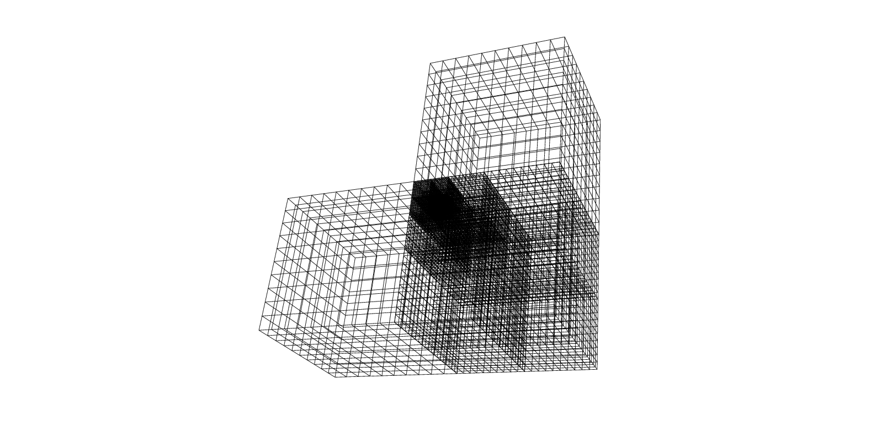
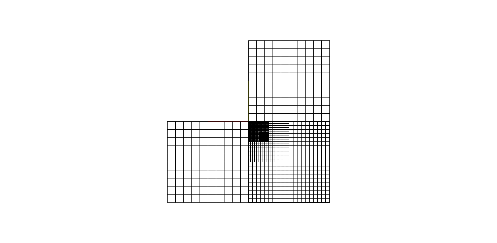
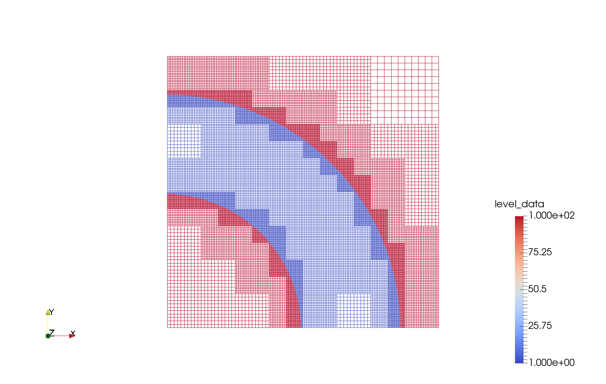

# AMRsolver - General advection solver on AMR grids

 * Octree data structure 
 * Block-based AMR
 * Dynamic mesh generation

## Things to add

 * Add neighbors - done
 * boundary flags - done
 * Make neighbors vary in refinement by 2 at the max - done
 * Add linked list for every level - done
 * Gradient based refinement - done
 * Input file
 * Output file
 * Multigrid implementation
 * Parallel implementation

## Sample mesh output

  
  <figcaption>3D view.</figcaption>

  
  <figcaption>2D view.</figcaption>

  
  <figcaption>Gradient based refinement with block nesting.</figcaption>

